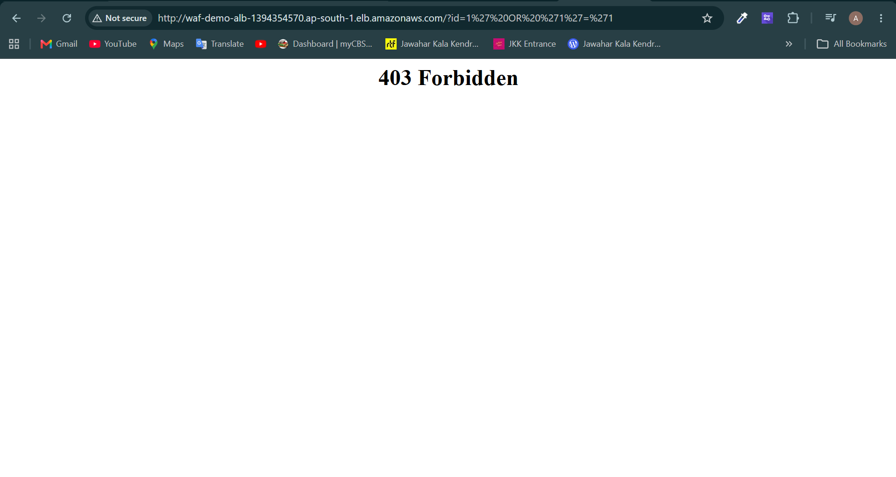
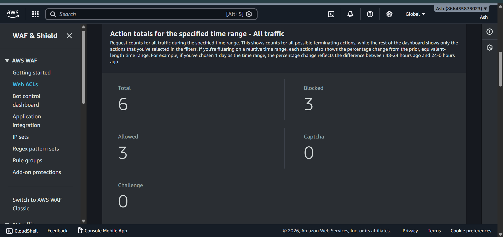

# 🛡️ Day 2 — AWS WAF (Web Application Firewall)

> **7 Days of AWS Challenge** | Day 2 of 7


---

## 📌 Project Overview

In this project, I secured a web application hosted on AWS EC2 against common web vulnerabilities using **AWS WAF (Web Application Firewall)**. The WAF was attached to an **Application Load Balancer (ALB)** to inspect and block malicious HTTP requests before they reach the server.

---

## 🏗️ Architecture

```
Internet (Users)
      │
      ▼
Application Load Balancer (ALB)
      │
      ▼
WAF Web ACL (Rules Engine)
   ├── SQL Injection Rule → BLOCK
   ├── XSS Rule → BLOCK
   ├── Common Rule Set → BLOCK
      │
      ▼
EC2 Instance (Ubuntu + Apache)
      │
      ▼
Web Application (Protected ✅)
```

---

## ✅ What I Completed

- [x] Launched EC2 instance on Ubuntu 24.04 LTS
- [x] Installed and configured Apache web server
- [x] Created Application Load Balancer (ALB)
- [x] Configured Target Group with health checks
- [x] Created WAF Web ACL with managed rules
- [x] Attached WAF to ALB (Regional scope)
- [x] Tested SQL Injection attack — got 403 Blocked
- [x] Tested XSS attack — got 403 Blocked
- [x] Verified blocked requests in WAF traffic dashboard

---

## 🔧 Tech Stack

| Service | Purpose |
|---|---|
| AWS EC2 (Ubuntu 24.04) | Host web application |
| Apache Web Server | Serve HTTP traffic |
| AWS ALB | Load balance and route traffic |
| AWS WAF | Inspect and block malicious requests |
| AWS CloudWatch | Monitor WAF metrics and logs |

---

## 🛡️ WAF Rules Used

| Rule | Type | Action |
|---|---|---|
| AWSManagedRulesCommonRuleSet | Managed | Block |
| AWSManagedRulesSQLiRuleSet | Managed | Block |
| IP Blocklist | Custom | Block |
| Geographic Restriction | Custom | Block |

---

## 🧪 Attack Tests Performed

### SQL Injection Test
```bash
curl "http://your-alb-dns/?id=1' OR '1'='1"
# Response: 403 Forbidden ✅
```

### XSS Attack Test
```bash
curl "http://your-alb-dns/?search=<script>alert('xss')</script>"
# Response: 403 Forbidden ✅
```

### Path Traversal Test
```bash
curl "http://your-alb-dns/?file=../../etc/passwd"
# Response: 403 Forbidden ✅
```

---

## 📸 Screenshots

### EC2 Instance Running
.png)

### Web App via ALB DNS


### WAF Web ACL Created


### WAF Rules with Block Action


### SQL Injection Blocked (403)


### WAF Traffic Dashboard


---

## 💡 Key Learnings

- **AWS WAF** protects against OWASP Top 10 attacks out of the box
- **WAF for ALB** must be **Regional** — same region as the ALB
- **WAF for CloudFront** must be **Global** — always in us-east-1
- Managed rule groups save time — no need to write rules from scratch
- Always test rules in **Count mode** before switching to **Block mode**
- WAF **does not attach directly to EC2** — needs ALB or CloudFront in front
- Always **delete resources** after testing to avoid unexpected charges

---

## 🔐 Security Best Practices Followed

- EC2 security group only allows traffic from ALB (not public internet)
- ALB security group allows only port 80 from anywhere
- WAF default action set to **Allow** — only matching rules get blocked
- Managed rules used instead of custom rules for reliability

---

## 💰 Cost Breakdown

| Resource | Cost |
|---|---|
| EC2 t2.micro | Free tier |
| ALB | ~$0.01/hour |
| WAF Web ACL | $5/month (pro-rated) |
| WAF Rules | $1/rule/month (pro-rated) |
| **Total for demo** | **~$0 (deleted same day)** |

---

## 🗂️ Project Structure

```
Day2-WAF/
├── README.md
└── screenshots/
    ├── ec2-running.png
    ├── alb-working.png
    ├── waf-created.png
    ├── waf-rules.png
    ├── 403-blocked.png
    └── traffic-graph.png
```

---

## 🚀 How to Reproduce

1. Launch EC2 instance (Ubuntu 24.04, t2.micro)
2. Install Apache:
```bash
sudo apt update -y
sudo apt install apache2 -y
sudo systemctl start apache2
echo "<h1>WAF Demo</h1>" | sudo tee /var/www/html/index.html
```
3. Create ALB and Target Group pointing to EC2
4. Create WAF Web ACL (Regional, same region as ALB)
5. Add `AWSManagedRulesCommonRuleSet` and `AWSManagedRulesSQLiRuleSet`
6. Attach WAF to ALB
7. Test with SQL injection and XSS queries

---

## 🔗 Connect With Me

[](https://linkedin.com/in/yourprofile)
[](https://github.com/yourusername)

---

## 📅 7 Days of AWS Challenge Progress

| Day | Topic | Status |
|---|---|---|
| Day 1 | - | ✅ Done |
| Day 2 | AWS WAF | ✅ Done |
| Day 3 | Coming Soon | 🔄 |
| Day 4 | Coming Soon | 🔄 |
| Day 5 | Coming Soon | 🔄 |
| Day 6 | Coming Soon | 🔄 |
| Day 7 | Coming Soon | 🔄 |

---

> Made with ❤️ as part of **#7DaysOfAWS** challenge by **@TrainWithShubham**

**#7DaysOfAWS #AWSwithTWS #AWS #CloudSecurity #WAF #DevOps**
